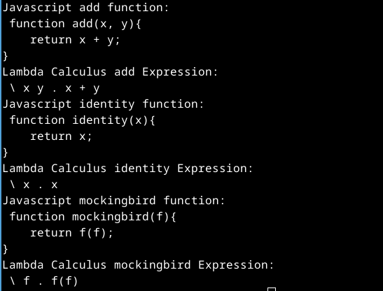

# JS to lambda expression

Converting fundamental JavaScript functions into lambda calculus expressions. Created primarily for personal study, this project focuses on basic lambda calculus concepts without unnecessary complexity. It's a simple tool that only tokenizes the function and extracts what is needed for a basic lambda expression. No Abstract Syntax Tree (AST) or compiling techniques are used. The goal is to keep it as simple as possible

[Examples](examples.js)
